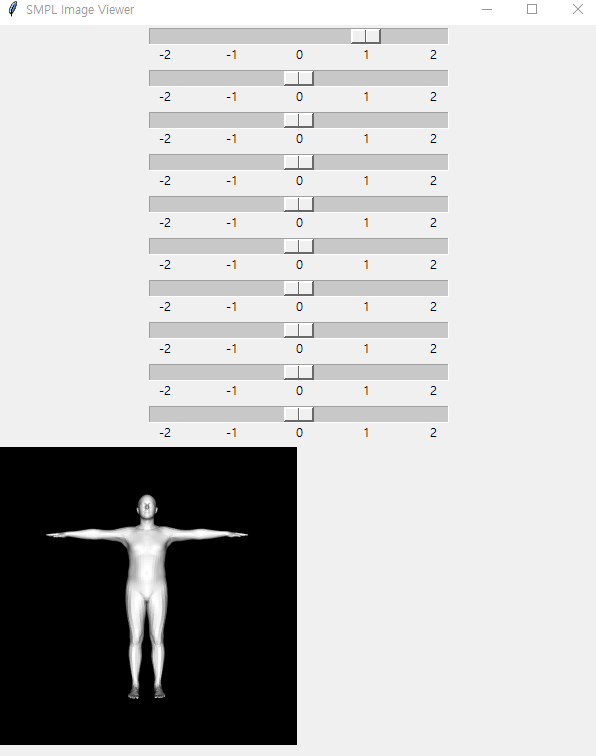

# SMPL_viewer

This is the SMPL body shape image viewer according to the shape parameters with Tkinter GUI. 

Download the SMPL obj data file in https://drive.google.com/file/d/17tuOfJoNShKeNfrn2rwAVYH-2vl0Uu61/view?usp=sharing

Scale bar means the SMPL shape parameters. (From top to bottom, 1-st parameter ~ 10-th parameter)

Only 1st~7th parameters are now available due to the memory issues. 

